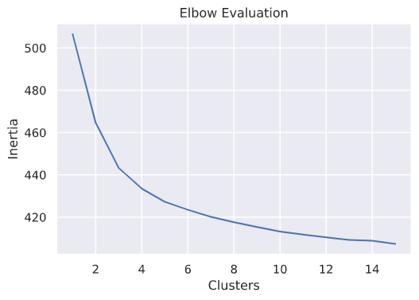

# Clustering Patients Based on Similar Treatment Patterns
```
Kahlil Wehmeyer, November 2020
Assesment for ArborMetrix
```

## Model
A KMeans model was built using 5 clusters. 
The number of clusters was chosen based on an elbow graph.
Where the Y axis represents the mean sum squared distance of all samples
to their closest cluster. The X axist represents the number of clusters.



This model clusters patients with similar treatment history. If more context
is given to the patients within clusters then the model could be used to make
recommendations and assumptions about patients. 

Example:
If patients in cluster $x$ historically ended up being diagnosed with some
sort of auto-immune disease ($\lambda$) then if a new patient is falls into
cluster $x$ they could be recommended to be tested preemptively for that disease
$\lambda$.


The initial model that is included with this project had a 
sum of squared distances of all samples to their nearest cluter cnetroid of 427.3


# Usage

## Training KMeans | `training.py`

The `training.py` script trains and saves a KMeans model. If **no** command line
arguements are specified it will attempt to use the `patients.csv` and 
`encounters.csv` files found in the  `data/` directory.

Different datasets can be specified as such

```
python training.py <path to patients data> <path to encounters data>
```

## Applying Model | `apply_model.py`

`apply_model.py` inputs datasets in the same format as those that were used to train
the initial models and returns the cluster predictions for all the patients.
The results are then written to a `.csv` file.

By default the provided datasets are used and the pretrained model is used.
But specific models and datasets can be specified as such

```
python apply_model.py <patients.csv> <encounters.csv> <path to model>
```

## Data

* SSN: Patient social security number.
* encounter_id: Unique identifier representing a visit to a medical provider.
* line_number: The number of the medical proceduce/diagnosis from a resulting encounter.
* icd10_code: Unique code representing some sort of medical procedure/diagnoses

### Notes:

1. Data is fully anonymized
   1. Social security numbers are hashed
   2. ICD10 codes are hashed
2. Unordered
   1. There is no indication of time.
   2. A patient with multiple encounters could have had them in any order.
   3. No assumptions about line number ordering is made.


### Areas of Improvement

* More robust the CLI argument handling
  * Improve error handling
  * Meaningful error messages
*  